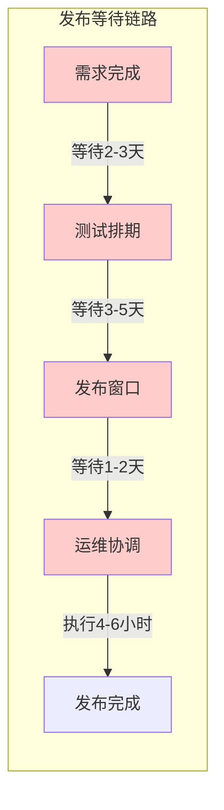
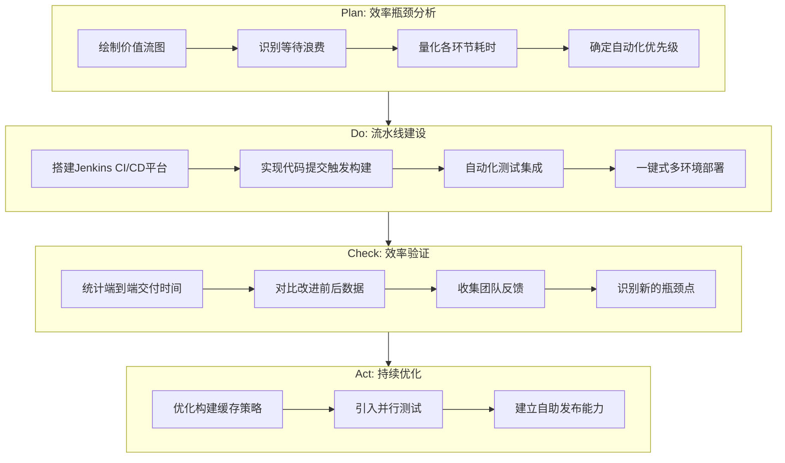
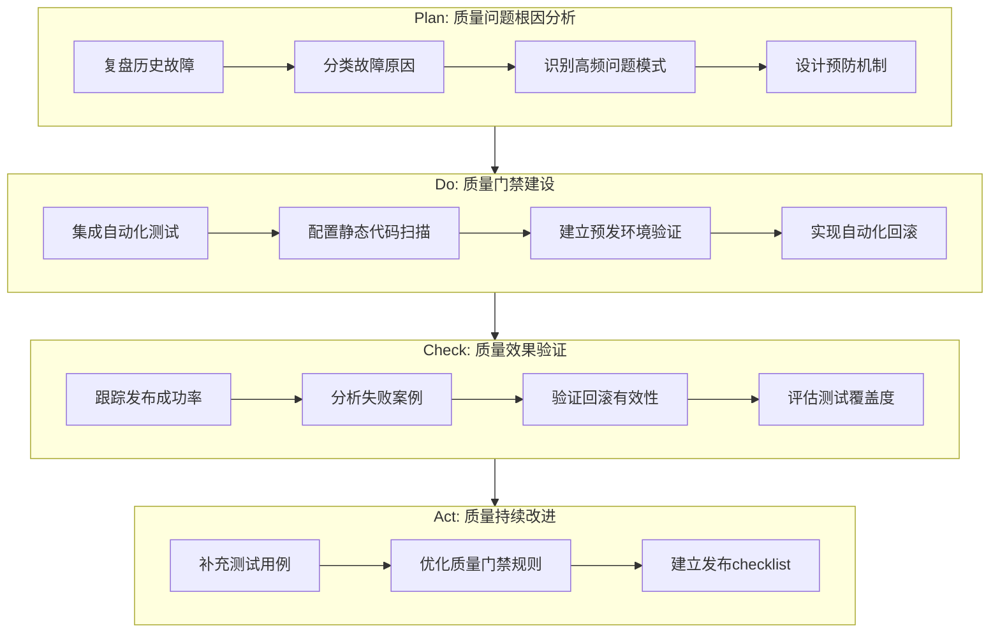
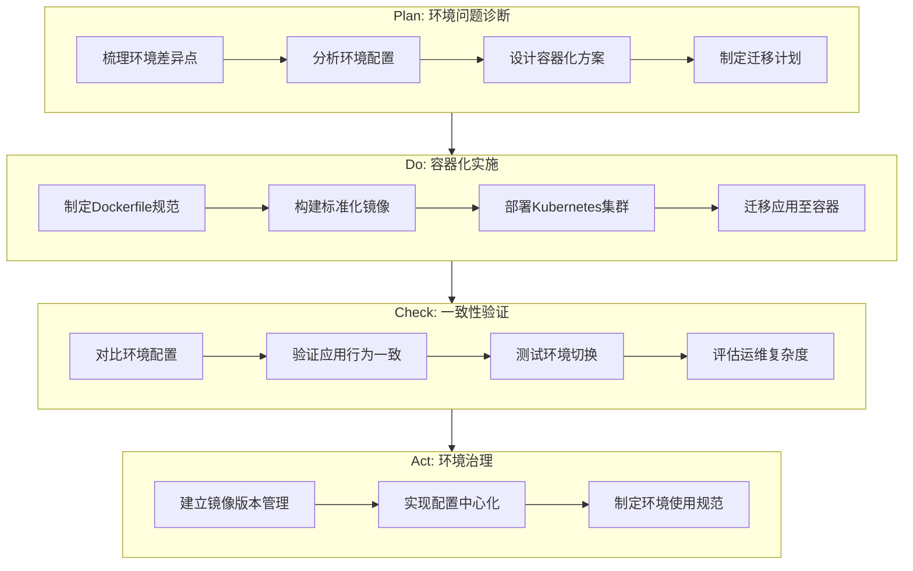
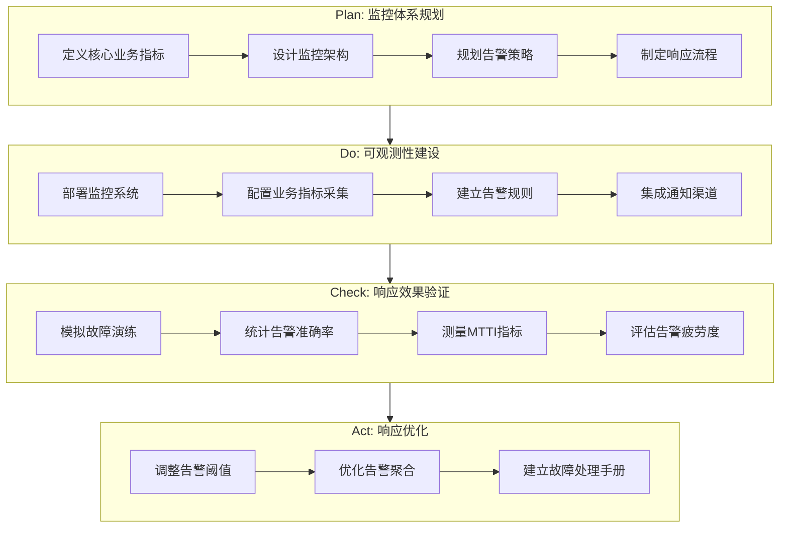
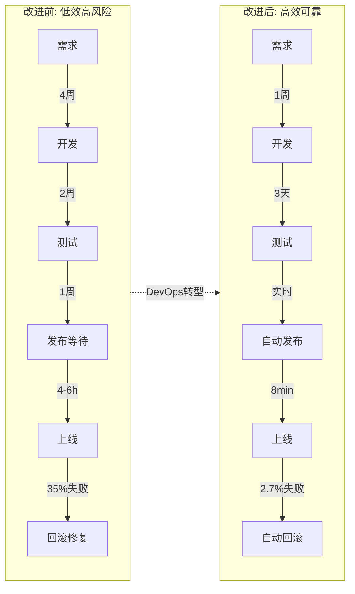

# 持续交付平台建设项目 - 业务痛点视角

## 项目概述

**项目名称**: 企业级持续交付平台建设  
**项目周期**: 2023.03 - 2023.12 (10个月)  
**团队规模**: 核心成员5人，协作团队20+人  
**角色定位**: 项目技术负责人，负责整体方案设计与落地推进  
**能力等级**: DevOps Level 1 → Level 3 演进

---

## STAR法则叙事

### Situation (业务背景与痛点分析)

2023年初，我所在的金融科技公司正处于业务快速扩张期。核心交易系统承载日均150万笔交易，月活用户突破200万。然而，软件交付能力已成为制约业务发展的关键瓶颈。

#### 痛点一: 发布效率低下，业务响应滞后

**现象描述**:
- 产品经理提出需求后，平均需要4-6周才能上线，其中发布等待时间占比超过40%
- 每月仅有2-3个发布窗口，错过窗口需再等两周
- 紧急Bug修复需要2-4小时协调资源，严重影响用户体验

**业务影响**:
- 2023年Q1，因发布延迟导致3个营销活动错过最佳时机，预估损失GMV约800万
- 竞品功能迭代速度是我们的3-4倍，市场竞争力下降



#### 痛点二: 发布失败频繁，线上稳定性差

**现象描述**:
- 2023年Q1发布成功率仅65%，每3次发布就有1次需要回滚或修复
- 回滚操作依赖人工记忆和手工操作，平均耗时1-2小时
- 发布失败后的故障定位困难，排查时间占总修复时间的60%以上

**业务影响**:
- Q1共发生4次因发布导致的P1级故障，累计影响用户约12万人次
- 单次P1故障平均造成直接经济损失约15-30万元（客诉赔付、交易损失）
- 技术团队信誉受损，业务部门对新功能上线持谨慎态度

**故障案例**:
| 日期 | 故障描述 | 影响时长 | 根因分析 |
|------|----------|----------|----------|
| 2023.02.15 | 配置文件覆盖导致服务无法启动 | 2.5小时 | 手工部署时使用了错误的配置文件 |
| 2023.03.08 | 依赖服务版本不兼容 | 1.5小时 | 本地构建环境与生产环境差异 |
| 2023.03.22 | 数据库连接池耗尽 | 3小时 | 新版本参数未正确配置，缺乏预发验证 |

#### 痛点三: 环境不一致，问题难复现

**现象描述**:
- 开发、测试、生产环境配置差异大，"在我机器上能跑"成为日常
- 测试环境与生产环境差异导致30%以上的Bug在上线后才被发现
- 环境搭建依赖运维手工操作，新环境准备周期2-3周

**业务影响**:
- 新项目启动被环境准备阻塞，平均延期1-2周
- 测试团队有效测试时间仅占工作时间的40%，大量时间花费在环境问题排查

#### 痛点四: 故障响应慢，客户满意度下降

**现象描述**:
- 线上问题依赖用户反馈或客服上报才能发现，平均发现时间30-60分钟
- 缺乏有效的监控手段，故障定位依赖人工查看日志
- 运维团队7x24小时值班，但仍无法保证及时响应

**业务影响**:
- Q1客户满意度调查中，系统稳定性评分仅3.2分（满分5分）
- VIP客户投诉率上升15%，部分大客户开始评估竞品

### Task (任务目标)

作为项目技术负责人，我需要从业务价值角度出发，解决以下核心问题：

1. **提升发布效率**: 将发布周期从"月级"提升至"日级"，支撑业务快速迭代
2. **保障发布质量**: 将发布成功率提升至95%以上，降低线上故障风险
3. **加速故障恢复**: 将MTTR从小时级降低至分钟级，最小化业务影响
4. **实现环境标准化**: 消除环境差异，提升测试有效性

**业务目标量化**:
| 业务指标 | 当前值 | 目标值 | 业务收益 |
|----------|--------|--------|----------|
| 需求交付周期 | 4-6周 | 1-2周 | 提升市场响应速度 |
| 发布成功率 | 65% | 95%+ | 降低故障成本 |
| 故障影响时长 | 2-4小时 | <30分钟 | 提升客户满意度 |
| 环境准备时间 | 2-3周 | <1天 | 加速项目启动 |

### Action (解决方案与实施过程)

#### PDCA循环一: 发布效率优化



**关键举措**:

1. **价值流分析与优化**
   
   通过价值流图(Value Stream Mapping)分析，发现原有流程中存在大量等待浪费：
   
   | 环节 | 原耗时 | 优化后 | 优化方式 |
   |------|--------|--------|----------|
   | 构建等待 | 4-8小时 | 实时触发 | Webhook自动触发 |
   | 测试环境部署 | 2-4小时 | 10分钟 | 容器化自动部署 |
   | 人工审批 | 1-2天 | 30分钟 | 流程并行化+移动审批 |
   | 发布执行 | 4-6小时 | 8分钟 | 全自动化流水线 |

2. **发布窗口制度改革**
   
   - 原制度: 每月2-3个固定发布窗口，需提前5天申请
   - 新制度: 工作日每天可发布，紧急发布随时可触发
   - 配套措施: 建立发布值班制度，确保有人响应发布问题

3. **研发自助能力建设**
   
   - 开发人员可自主完成开发/测试环境部署
   - 发布审批流程线上化，支持移动端审批
   - 提供发布状态实时看板，透明化发布进度

#### PDCA循环二: 发布质量保障



**关键举措**:

1. **故障模式分析与预防**

   通过对Q1的12次发布失败进行根因分析，归纳出四类主要问题：
   
   | 故障类型 | 占比 | 预防措施 |
   |----------|------|----------|
   | 配置错误 | 35% | 配置分离+配置校验 |
   | 环境差异 | 25% | 容器化+镜像统一 |
   | 依赖问题 | 22% | 依赖锁定+兼容性测试 |
   | 人为操作失误 | 18% | 全自动化+审批流程 |

2. **质量门禁体系建设**

   建立分层质量门禁，在流水线各阶段设置质量关卡：
   
   ```
   代码提交 → 单元测试(覆盖率>60%) → 代码扫描(无阻断问题) 
           → 集成测试(通过率100%) → 预发验证(核心场景通过) 
           → 生产发布
   ```

3. **自动化回滚能力建设**
   
   - 基于Kubernetes实现一键回滚，回滚耗时从1-2小时降低至2分钟
   - 建立回滚触发机制：核心指标异常自动触发回滚评估
   - 保留最近5个版本的快速回滚能力

#### PDCA循环三: 环境标准化



**关键举措**:

1. **"一次构建，多处运行"原则**
   
   - 同一镜像在开发、测试、预发、生产环境运行
   - 环境差异通过配置注入实现，而非镜像差异
   - 实现真正的"不可变基础设施"

2. **环境自助能力**
   
   | 能力 | 原状态 | 改进后 |
   |------|--------|--------|
   | 开发环境 | 本地手工配置 | 一键启动标准化容器 |
   | 测试环境 | 运维手工搭建(2-3周) | 自助申请(30分钟) |
   | 预发环境 | 共享环境冲突频繁 | 按需创建独立环境 |

3. **环境配置版本化**
   
   - 所有环境配置纳入Git版本控制
   - 配置变更通过PR审核机制
   - 支持配置的版本回溯与对比

#### PDCA循环四: 故障响应加速



**关键举措**:

1. **业务指标监控体系**
   
   从业务视角定义核心监控指标：
   
   | 业务场景 | 监控指标 | 告警阈值 | 响应等级 |
   |----------|----------|----------|----------|
   | 用户登录 | 登录成功率 | <99% | P1 |
   | 订单创建 | 订单创建延迟P99 | >2s | P1 |
   | 支付交易 | 支付成功率 | <99.5% | P0 |
   | 数据同步 | 同步延迟 | >5min | P2 |

2. **故障发现能力提升**
   
   - 从"用户反馈驱动"转变为"监控预警驱动"
   - 实现关键业务指标的秒级监控
   - 告警通知多渠道覆盖：钉钉、短信、电话轮询

3. **故障响应流程标准化**
   
   ```
   告警触发 → 值班人员确认(5min) → 影响评估(5min) 
           → 快速止血(回滚/限流) → 根因分析 → 复盘改进
   ```

### Result (业务成果)

#### 效率提升成果

| 指标 | 改进前 | 改进后 | 业务价值 |
|------|--------|--------|----------|
| 需求交付周期 | 4-6周 | 1-2周 | 市场响应速度提升3倍 |
| 发布频率 | 2-3次/月 | 15-20次/周 | 支撑敏捷迭代 |
| 发布等待时间 | 1-2周 | <1天 | 消除发布瓶颈 |
| 紧急修复时间 | 2-4小时 | 15-30分钟 | 快速响应线上问题 |

**业务案例**: 2023年双11大促前，业务部门提出紧急功能需求，从需求确认到上线仅用时3天，较以往缩短80%，成功支撑大促活动。

#### 质量提升成果

| 指标 | 改进前 | 改进后 | 业务价值 |
|------|--------|--------|----------|
| 发布成功率 | 65% | 97.3% | 降低发布风险 |
| 线上故障数 | 4次/季度(P1) | 0次/季度(P1) | 提升系统稳定性 |
| 回滚耗时 | 1-2小时 | 2分钟 | 最小化故障影响 |
| 变更失败率 | 35% | 2.7% | 增强业务信心 |

**经济效益**: 按照单次P1故障平均损失20万元计算，Q3/Q4零P1故障，预估避免直接损失约160万元。

#### 客户满意度提升

| 指标 | 改进前 | 改进后 | 业务价值 |
|------|--------|--------|----------|
| 系统稳定性评分 | 3.2/5 | 4.5/5 | 客户信任度提升 |
| VIP客户投诉率 | 15%上升 | 8%下降 | 客户留存改善 |
| MTTI | 30-60分钟 | 3分钟 | 故障快速发现 |
| MTTR | 2-4小时 | 18分钟 | 故障快速恢复 |

#### 团队效能提升

| 指标 | 改进前 | 改进后 | 业务价值 |
|------|--------|--------|----------|
| 运维人工操作时间 | 40小时/月 | 5小时/月 | 释放运维产能 |
| 环境准备时间 | 2-3周 | <1天 | 加速项目启动 |
| 测试有效时间占比 | 40% | 75% | 提升测试效能 |
| 开发人员发布等待时间 | 8小时/周 | <1小时/周 | 提升开发体验 |

#### 整体价值流改进



---

## 项目复盘与思考

### 成功因素

1. **业务痛点驱动**: 始终从业务价值出发，优先解决影响最大的问题
2. **渐进式演进**: 采用PDCA循环，小步快跑，持续验证效果
3. **数据驱动决策**: 建立完善的度量体系，用数据说话
4. **全员参与**: 通过培训和赋能，让开发团队成为平台的使用者和贡献者

### 经验教训

1. **技术选型要务实**: 容器化初期过度追求技术先进性，导致学习成本较高。后续调整为"够用就好"的原则
2. **变革需要耐心**: 改变团队习惯需要时间，通过试点项目积累成功案例是关键
3. **监控不是越多越好**: 初期配置了大量告警规则，导致告警疲劳。后续精简为核心指标

### 未来规划

1. **GitOps深化**: 推进基础设施即代码，实现全面的声明式部署
2. **混沌工程**: 引入故障注入演练，提升系统韧性
3. **AIOps探索**: 利用机器学习辅助故障预测和根因分析

---

*文档版本: v1.0*  
*最后更新: 2024.01*


