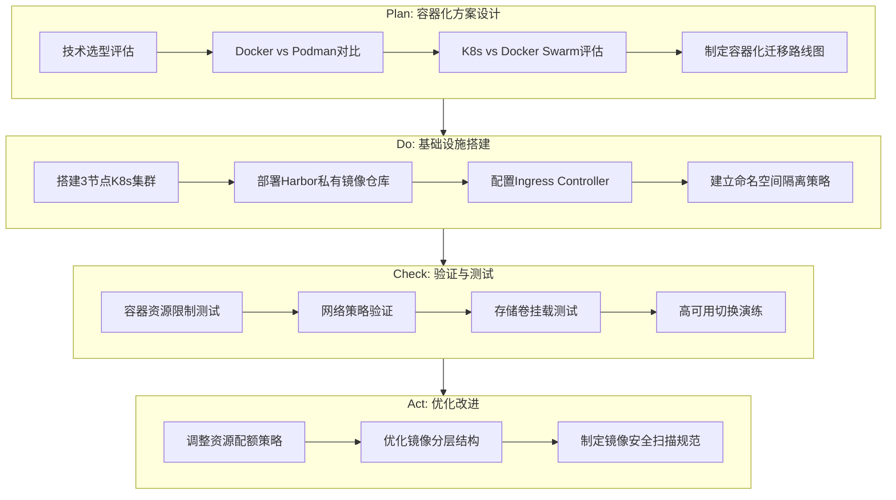
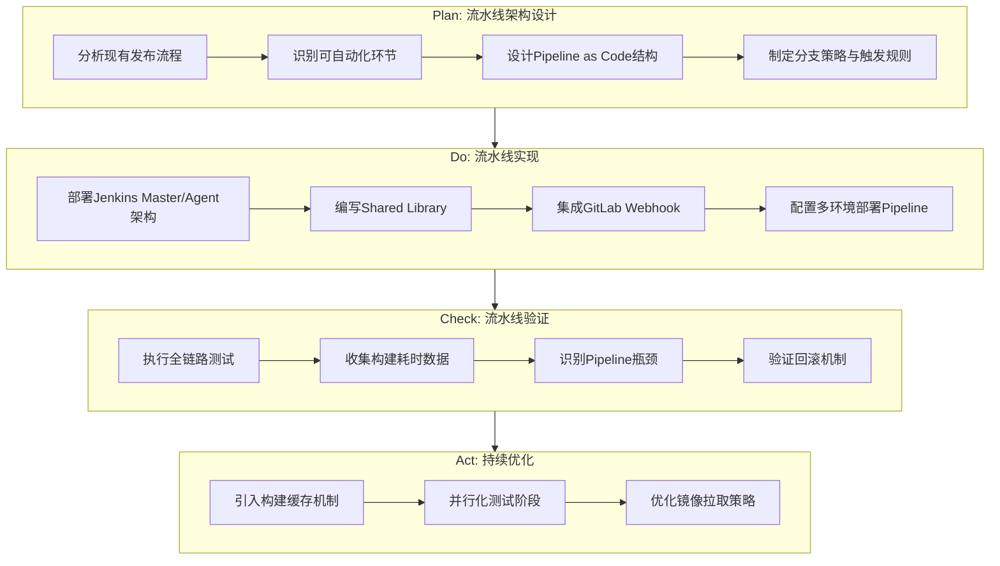
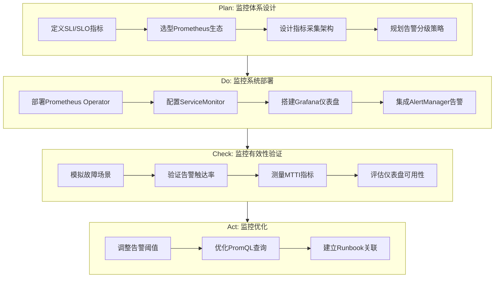
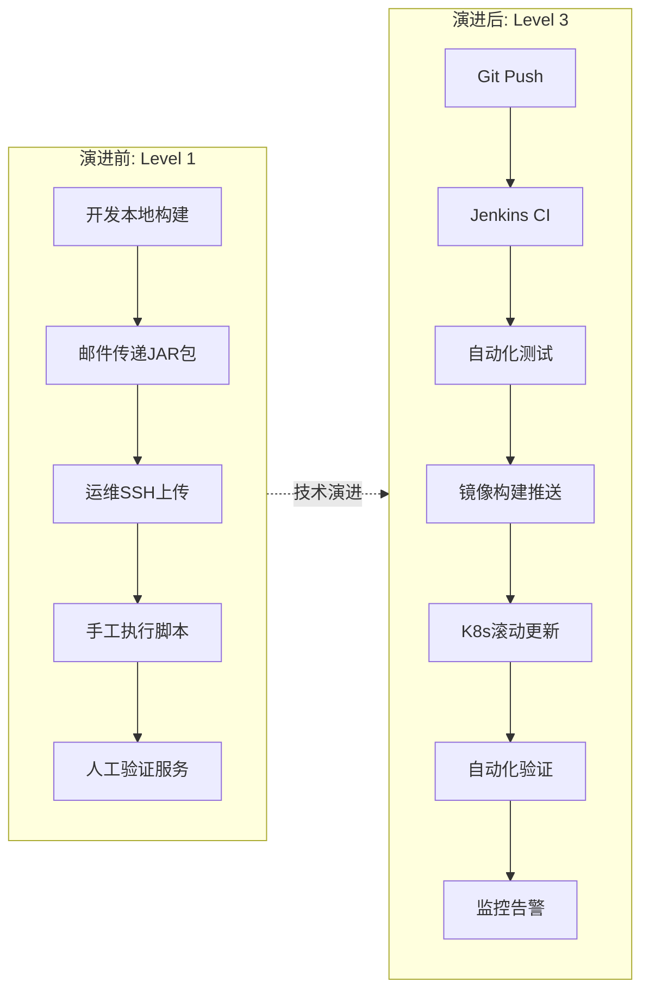

# 持续交付平台建设项目 - 技术演进视角

## 项目概述

**项目名称**: 企业级持续交付平台建设  
**项目周期**: 2023.03 - 2023.12 (10个月)  
**团队规模**: 核心成员5人，协作团队20+人  
**技术栈**: Jenkins, Docker, Kubernetes, Harbor, GitLab, Prometheus, Grafana, Ansible  
**能力等级**: DevOps Level 1 → Level 3 演进

---

## STAR法则叙事

### Situation (背景情境)

2023年初，我加入某金融科技公司担任SRE工程师。公司核心业务系统包含32个微服务模块，日均处理交易量约150万笔。然而，整个软件交付体系仍停留在DevOps能力模型的Level 1阶段，存在以下技术债务：

**架构现状诊断**:
- **部署方式**: 运维人员手工通过SSH连接服务器，使用SCP上传JAR包，执行shell脚本启动服务
- **环境管理**: 仅有生产/测试两套环境，环境配置散落在各服务器本地，无版本化管理
- **构建流程**: 开发人员本地执行Maven构建，构建产物通过企业微信/邮件传递给运维
- **监控体系**: 依赖Nginx访问日志进行事后分析，无实时监控告警能力
- **版本控制**: 代码仓库与部署版本无关联，回滚依赖人工记忆"上一个能用的包"

**关键风险指标**:
| 指标 | 现状值 | 行业基准 |
|------|--------|----------|
| 部署频率 | 2-3次/月 | 日级/周级 |
| 单次部署耗时 | 4-6小时 | <30分钟 |
| 部署成功率 | 65% | >95% |
| 平均故障恢复时间(MTTR) | 2-4小时 | <30分钟 |
| 变更失败率 | 35% | <5% |

### Task (任务目标)

作为该项目的技术负责人，我需要完成以下技术目标：

1. **基础设施层**: 搭建容器化运行环境，实现应用与环境的解耦
2. **流水线层**: 构建端到端的CI/CD流水线，实现从代码提交到生产部署的全自动化
3. **制品管理层**: 建立统一的制品仓库，实现构建产物的版本化、可追溯
4. **可观测性层**: 构建完整的监控告警体系，实现故障的快速发现与定位
5. **标准化层**: 制定发布规范与流程，降低人为因素导致的失败风险

**量化目标设定**:
- 部署频率提升至日级别
- 单次部署耗时降低至15分钟以内
- 部署成功率提升至95%以上
- MTTR降低至30分钟以内

### Action (行动方案)

#### PDCA循环一: 容器化基础设施建设 (Plan-Do-Check-Act)



**技术实施细节**:

1. **Kubernetes集群架构**:
   - Master节点: 3台 (4C8G)，采用Stacked etcd拓扑实现高可用
   - Worker节点: 6台 (8C16G)，按业务域划分节点池
   - 网络方案: Calico CNI，支持NetworkPolicy实现Pod级网络隔离
   - 存储方案: NFS StorageClass用于日志持久化，本地SSD用于有状态服务

2. **镜像仓库设计**:
   - 部署Harbor 2.x，启用Trivy漏洞扫描
   - 建立镜像命名规范: `harbor.company.com/{project}/{app}:{git-short-hash}-{timestamp}`
   - 配置镜像保留策略: 保留最近30个tag，release分支永久保留

3. **Dockerfile标准化**:
```dockerfile
# 多阶段构建示例
FROM maven:3.8-openjdk-11 AS builder
WORKDIR /build
COPY pom.xml .
RUN mvn dependency:go-offline
COPY src ./src
RUN mvn package -DskipTests

FROM openjdk:11-jre-slim
WORKDIR /app
COPY --from=builder /build/target/*.jar app.jar
RUN groupadd -r appuser && useradd -r -g appuser appuser
USER appuser
EXPOSE 8080
ENTRYPOINT ["java", "-jar", "app.jar"]
```

#### PDCA循环二: Jenkins流水线体系构建



**Jenkins架构设计**:

1. **Master-Agent架构**:
   - Master节点: 负责调度与UI，不执行构建任务
   - Agent节点: 3个静态Agent + Kubernetes动态Pod Agent
   - 采用JNLP协议实现Agent连接，支持动态扩缩容

2. **Shared Library核心模块**:
```groovy
// vars/standardPipeline.groovy
def call(Map config) {
    pipeline {
        agent { kubernetes { yaml podTemplate() } }
        
        environment {
            HARBOR_CREDS = credentials('harbor-credentials')
            APP_NAME = "${config.appName}"
            GIT_SHORT_HASH = sh(script: 'git rev-parse --short HEAD', returnStdout: true).trim()
        }
        
        stages {
            stage('Checkout') {
                steps { checkout scm }
            }
            
            stage('Build & Test') {
                parallel {
                    stage('Unit Test') {
                        steps { sh 'mvn test' }
                        post {
                            always { junit '**/target/surefire-reports/*.xml' }
                        }
                    }
                    stage('Code Quality') {
                        steps { sh 'mvn sonar:sonar' }
                    }
                }
            }
            
            stage('Build Image') {
                steps {
                    script {
                        def imageTag = "${env.GIT_SHORT_HASH}-${BUILD_NUMBER}"
                        docker.build("harbor.company.com/prod/${APP_NAME}:${imageTag}")
                        docker.withRegistry('https://harbor.company.com', 'harbor-credentials') {
                            docker.image("harbor.company.com/prod/${APP_NAME}:${imageTag}").push()
                        }
                    }
                }
            }
            
            stage('Deploy to Dev') {
                when { branch 'develop' }
                steps { deployToK8s('dev', env.GIT_SHORT_HASH) }
            }
            
            stage('Deploy to Staging') {
                when { branch 'release/*' }
                steps { 
                    deployToK8s('staging', env.GIT_SHORT_HASH)
                    runIntegrationTests()
                }
            }
            
            stage('Deploy to Production') {
                when { branch 'main' }
                steps {
                    input message: '确认部署到生产环境?', ok: '确认部署'
                    deployToK8s('prod', env.GIT_SHORT_HASH)
                }
            }
        }
        
        post {
            success { notifyDingTalk('success') }
            failure { notifyDingTalk('failure') }
        }
    }
}
```

3. **部署策略实现**:
```groovy
// vars/deployToK8s.groovy
def call(String env, String imageTag) {
    withKubeConfig([credentialsId: "kubeconfig-${env}"]) {
        sh """
            kubectl set image deployment/${APP_NAME} \
                ${APP_NAME}=harbor.company.com/prod/${APP_NAME}:${imageTag}-${BUILD_NUMBER} \
                -n ${env} --record
            
            kubectl rollout status deployment/${APP_NAME} -n ${env} --timeout=300s
        """
    }
}
```

#### PDCA循环三: 可观测性体系建设



**监控指标体系设计**:

| 层次 | 指标类型 | 采集方式 | 示例指标 |
|------|----------|----------|----------|
| 基础设施 | 节点/容器资源 | node-exporter, cAdvisor | CPU使用率, 内存使用率, 磁盘IO |
| 应用层 | RED指标 | Micrometer + Prometheus | 请求速率, 错误率, 延迟分布 |
| 业务层 | 业务指标 | 自定义埋点 | 订单处理量, 支付成功率 |
| 流水线 | 构建指标 | Jenkins Prometheus Plugin | 构建耗时, 成功率, 排队时间 |

**告警规则示例**:
```yaml
groups:
  - name: application-alerts
    rules:
      - alert: HighErrorRate
        expr: |
          sum(rate(http_server_requests_seconds_count{status=~"5.."}[5m])) 
          / sum(rate(http_server_requests_seconds_count[5m])) > 0.01
        for: 2m
        labels:
          severity: critical
        annotations:
          summary: "服务{{ $labels.application }}错误率过高"
          description: "当前错误率: {{ $value | humanizePercentage }}"
          
      - alert: HighLatency
        expr: |
          histogram_quantile(0.99, sum(rate(http_server_requests_seconds_bucket[5m])) 
          by (le, application)) > 1
        for: 5m
        labels:
          severity: warning
        annotations:
          summary: "服务{{ $labels.application }} P99延迟过高"
```

### Result (项目成果)

#### 核心指标改善

| 指标 | 改进前 | 改进后 | 提升幅度 |
|------|--------|--------|----------|
| 部署频率 | 2-3次/月 | 15-20次/周 | 约25倍 |
| 单次部署耗时 | 4-6小时 | 8-12分钟 | 约95%降低 |
| 部署成功率 | 65% | 97.3% | 32.3%提升 |
| 平均故障恢复时间(MTTR) | 2-4小时 | 18分钟 | 约90%降低 |
| 平均故障发现时间(MTTI) | 30-60分钟 | 3分钟 | 约95%降低 |
| 变更失败率 | 35% | 2.7% | 约92%降低 |
| 回滚耗时 | 1-2小时 | 2分钟 | 约98%降低 |

#### 技术资产沉淀

1. **标准化组件**:
   - Jenkins Shared Library: 覆盖32个微服务的标准化Pipeline
   - Helm Charts: 15套通用应用部署模板
   - Dockerfile模板: 6套不同技术栈的最佳实践模板

2. **知识文档**:
   - 《容器化迁移指南》: 涵盖18个常见问题的解决方案
   - 《流水线开发规范》: 定义了Pipeline编写的12条核心规范
   - 《故障处理手册》: 30+个常见故障的Runbook

3. **平台能力**:
   - 支持蓝绿部署、金丝雀发布两种发布策略
   - 实现配置与代码分离，支持配置热更新
   - 建立完整的审计日志，满足金融合规要求

#### 整体架构演进图



---

## 技术亮点总结

1. **Pipeline as Code**: 将流水线定义纳入版本控制，实现流水线的可审计、可回溯、可复用
2. **GitOps实践**: 以Git作为单一事实来源，所有变更通过Pull Request触发，实现变更的可追踪
3. **不可变基础设施**: 通过容器镜像实现环境一致性，杜绝"在我机器上能跑"问题
4. **Shift-Left安全**: 在CI阶段集成镜像漏洞扫描和代码安全检查，将安全左移
5. **可观测性驱动**: 基于Prometheus + Grafana构建完整的可观测性体系，实现故障的快速定位

---

*文档版本: v1.0*  
*最后更新: 2024.01*


