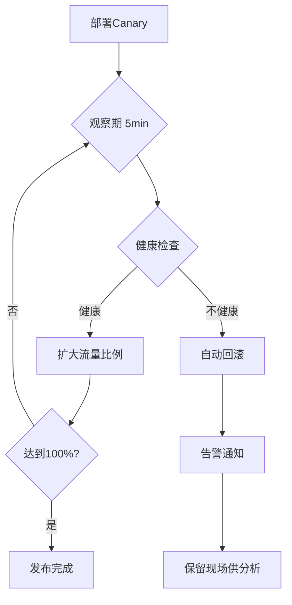
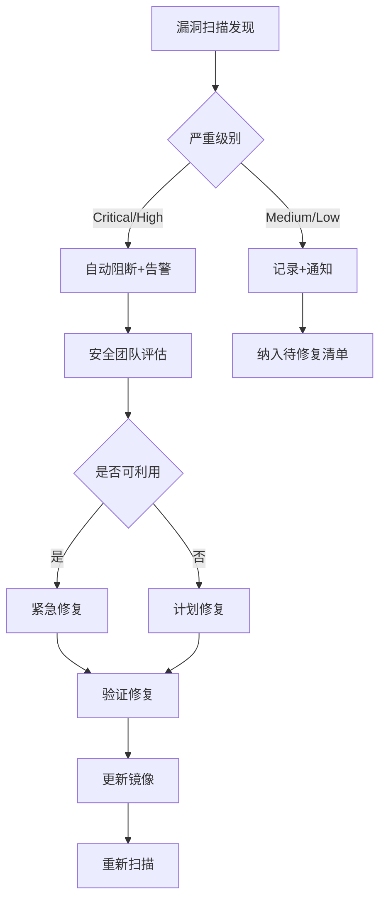

# 持续交付平台面试问答 - Part 1: 技术深度考察

> 面试官视角：作为一位资深云原生/SRE面试官，本部分聚焦于候选人的技术深度，采用"钻孔式"提问（Drill-down），由浅入深，层层递进，考察候选人对技术细节的理解深度和实践经验。

---

## 考察维度一: CI/CD架构设计与高可用

### 第一层提问 (基础认知)

**面试官**: 我看到你负责搭建了基于Jenkins的CI/CD流水线。能否介绍一下你们的Jenkins架构设计？为什么选择这样的架构？

**参考回答**:

我们采用的是Jenkins Master-Agent分布式架构，核心设计考量如下：

**架构组成**：
- Master节点：3台，采用高可用部署，负责任务调度、UI展示、配置管理
- 静态Agent节点：3台，用于处理常规构建任务，配置较高（8C16G）
- 动态Agent：基于Kubernetes的Pod Agent，按需创建销毁

**选择该架构的原因**：

1. **职责分离原则**：Master节点不执行构建任务，避免构建负载影响调度稳定性
2. **弹性扩展能力**：通过K8s动态Pod Agent，可以应对构建高峰期的并发需求，高峰期构建并发可从日常的10个扩展到50个
3. **资源利用率优化**：静态Agent处理日常负载，动态Agent应对峰值，成本与效率平衡
4. **故障隔离**：单个Agent故障不影响其他任务执行，Master高可用避免单点故障

**关键配置决策**：
- Agent与Master通过JNLP协议通信，支持跨网络部署
- 构建工作空间采用Pod内临时存储，构建完成自动清理，避免存储泄漏
- 敏感凭据存储在Jenkins Credentials，并与HashiCorp Vault集成

---

### 第二层提问 (深入细节)

**面试官**: 你提到了Master高可用，能详细说说是怎么实现的？Jenkins Master宕机时，正在运行的构建任务会发生什么？

**参考回答**:

Jenkins Master的高可用是我们在实践中逐步优化的重点领域。

**高可用架构实现**：

1. **存储层面**：
   - JENKINS_HOME目录挂载到NFS共享存储，确保配置、任务历史持久化
   - 采用NFS而非块存储，是因为Jenkins对存储IOPS要求不高，但需要多节点共享访问能力

2. **服务层面**：
   - Jenkins Master以Deployment形式部署在K8s中，replicas=1（单活）
   - 配置livenessProbe和readinessProbe，检测Jenkins健康状态
   - 通过Service暴露服务，Ingress提供统一入口

3. **故障转移机制**：
   - K8s检测到Pod不健康后，自动重调度到其他节点
   - 新Pod启动后从NFS加载JENKINS_HOME，恢复服务
   - 实测故障转移时间：3-5分钟（包含Pod调度、Jenkins启动、初始化）

**正在运行的任务处理**：

这是一个很好的问题，也是我们实际遇到过的痛点。

1. **现象**：Master宕机时，所有正在执行的构建任务会被标记为"Aborted"状态
2. **原因**：Jenkins的任务状态维护在Master内存中，Master重启后丢失运行时状态
3. **应对措施**：
   - 流水线设计为幂等可重入，任务失败后可安全重试
   - 配置了Build Failure Analyzer插件，自动分析失败原因
   - 建立了失败任务自动重试机制（最多3次）
   - 关键构建任务配置了Webhook回调，失败时通知相关人员

4. **改进方向**：我们正在评估Jenkins X和Tekton等云原生CI方案，它们将任务状态持久化到K8s CRD中，天然支持任务恢复。

---

### 第三层提问 (边界场景与演进)

**面试官**: 听起来这套方案还存在一些不足。如果GitLab的Webhook通知到达时Jenkins正好不可用，这个构建请求会丢失吗？你们是如何处理这种情况的？

**参考回答**:

这个问题非常尖锐，直击我们架构的薄弱环节。确实，Webhook丢失是我们在生产环境中遇到过的真实问题。

**问题分析**：

Webhook通知是"推"模式，具有以下特点：
- 无重试保证：GitLab默认只重试失败的Webhook调用，但Jenkins不可用时返回的可能是网络超时，不一定触发重试
- 无持久化：Webhook请求是一次性的，丢失后无法恢复
- 时序依赖：如果在Jenkins恢复后才重试成功，可能与后续提交产生时序问题

**我们的解决方案是多层防护**：

**第一层：提高Webhook送达成功率**

```yaml
# GitLab Webhook配置
timeout: 30s
retry: 3
retry_interval: 10s
```
- 延长超时时间，增加重试次数
- 但这只能缓解，无法根本解决

**第二层：补偿机制——定时轮询**

```groovy
// Jenkins定时任务，每5分钟扫描一次
triggers {
    pollSCM('H/5 * * * *')
}
```
- 作为Webhook的兜底方案，即使Webhook丢失，最多5分钟后也会被扫描发现
- 权衡：增加了GitLab API调用压力，但确保了不丢失任何提交

**第三层：消息队列解耦（后续演进）**

```
GitLab Webhook → RabbitMQ → Consumer → Trigger Jenkins
```
- 在Webhook和Jenkins之间引入消息队列
- 消息持久化，消费者确认机制，确保消息不丢失
- 支持消息重放，可恢复任意时间点的构建请求

**实际效果**：
- 引入补偿机制后，构建触发成功率从98.5%提升到99.9%
- 剩余0.1%的情况主要是代码配置错误导致的触发失败，属于预期行为

**反思与延伸**：

这个问题让我认识到，在设计分布式系统时，必须考虑每个环节的失败模式。Webhook作为系统间集成的常见模式，其"推"模式的局限性需要通过架构手段来补偿。这也是为什么业界逐渐倾向于GitOps的"拉"模式（如ArgoCD、Flux），由部署系统主动拉取期望状态，天然具备最终一致性保证。

---

## 考察维度二: Kubernetes调度与资源管理

### 第一层提问 (基础认知)

**面试官**: 你们将32个微服务部署到Kubernetes上，能介绍一下资源管理方面的实践吗？如何确定每个服务的资源配置？

**参考回答**:

资源管理是Kubernetes运维的核心挑战之一，我们建立了一套系统化的资源管理实践。

**资源配置确定方法**：

1. **基线建立**：
   - 新服务上线前，在预发环境进行压力测试，观察CPU和内存使用曲线
   - 使用Prometheus收集资源指标，Grafana可视化分析
   - 得出服务在不同QPS下的资源消耗特征

2. **资源配置规范**：

```yaml
resources:
  requests:
    cpu: "500m"      # 基于日常负载P50设置
    memory: "512Mi"  # 基于稳定状态内存+20%缓冲
  limits:
    cpu: "2000m"     # 基于峰值负载P99设置
    memory: "1024Mi" # 基于最大内存+50%缓冲（防OOM）
```

3. **资源分级策略**：

| 服务等级 | Request/Limit比例 | QoS Class | 适用场景 |
|----------|-------------------|-----------|----------|
| 核心服务 | 1:1 | Guaranteed | 支付、订单等关键链路 |
| 重要服务 | 1:2 | Burstable | 用户服务、商品服务 |
| 普通服务 | 1:4 | Burstable | 后台任务、数据同步 |

4. **持续优化机制**：
   - 建立资源利用率周报，识别过度分配的服务
   - 配置VPA（Vertical Pod Autoscaler）的recommend模式，获取优化建议
   - 季度性资源配置评审，结合业务增长趋势调整

---

### 第二层提问 (深入细节)

**面试官**: 你提到了不同的QoS Class，能具体解释一下在资源争抢时，Kubernetes如何处理不同QoS的Pod？你们遇到过因此导致的问题吗？

**参考回答**:

这是一个非常关键的技术点，直接关系到集群的稳定性。

**Kubernetes QoS机制**：

当节点资源紧张时，Kubernetes通过QoS Class决定驱逐优先级：

1. **BestEffort**（最先被驱逐）：未设置request/limit的Pod
2. **Burstable**（其次被驱逐）：request < limit的Pod
3. **Guaranteed**（最后被驱逐）：request = limit的Pod

驱逐顺序的具体逻辑：
- 同一QoS Class内，优先驱逐资源使用量超过request比例更高的Pod
- 考虑Pod Priority，高优先级Pod更不容易被驱逐

**我们遇到的实际问题**：

2023年Q2，我们经历了一次因资源争抢导致的服务雪崩：

**事故经过**：
1. 某数据处理服务出现内存泄漏，内存使用率持续上升
2. 该服务与核心订单服务部署在同一节点
3. 节点内存压力触发kubelet的eviction机制
4. 由于订单服务配置为Burstable（当时的疏忽），被连带驱逐
5. 订单服务重调度期间（约2分钟），影响了部分用户下单

**根因分析**：
- 核心服务未配置为Guaranteed级别
- 未配置PodDisruptionBudget限制同时驱逐的Pod数量
- 缺乏节点资源监控告警

**改进措施**：

1. **服务分级与资源策略绑定**：
```yaml
# 核心服务强制Guaranteed
resources:
  requests:
    cpu: "1000m"
    memory: "1024Mi"
  limits:
    cpu: "1000m"     # request = limit
    memory: "1024Mi"
```

2. **节点亲和性隔离**：
```yaml
affinity:
  nodeAffinity:
    requiredDuringSchedulingIgnoredDuringExecution:
      nodeSelectorTerms:
        - matchExpressions:
            - key: node-type
              operator: In
              values: ["core-business"]
```

3. **PodDisruptionBudget配置**：
```yaml
apiVersion: policy/v1
kind: PodDisruptionBudget
metadata:
  name: order-service-pdb
spec:
  minAvailable: 2
  selector:
    matchLabels:
      app: order-service
```

4. **资源预警机制**：节点资源使用率超过70%时告警，提前扩容或迁移负载

---

### 第三层提问 (边界场景与演进)

**面试官**: 在多租户场景下，如何防止某个团队的服务过度占用集群资源，影响其他团队？你们是如何做资源配额管理的？

**参考回答**:

多租户资源隔离是平台化运营的必修课，我们通过多层次的配额管理来解决这个问题。

**资源配额体系设计**：

**第一层：Namespace级别配额**

```yaml
apiVersion: v1
kind: ResourceQuota
metadata:
  name: team-a-quota
  namespace: team-a
spec:
  hard:
    requests.cpu: "20"
    requests.memory: "40Gi"
    limits.cpu: "40"
    limits.memory: "80Gi"
    pods: "100"
    services: "20"
    persistentvolumeclaims: "10"
```

**第二层：LimitRange默认值**

```yaml
apiVersion: v1
kind: LimitRange
metadata:
  name: default-limits
  namespace: team-a
spec:
  limits:
    - default:
        cpu: "500m"
        memory: "512Mi"
      defaultRequest:
        cpu: "100m"
        memory: "128Mi"
      max:
        cpu: "4"
        memory: "8Gi"
      min:
        cpu: "50m"
        memory: "64Mi"
      type: Container
```

**第三层：Priority Class分级**

```yaml
apiVersion: scheduling.k8s.io/v1
kind: PriorityClass
metadata:
  name: team-a-critical
value: 1000000
globalDefault: false
description: "Team A关键业务服务"
preemptionPolicy: PreemptLowerPriority
```

**配额分配策略**：

| 团队类型 | CPU配额 | 内存配额 | Pod数上限 | 分配依据 |
|----------|---------|----------|-----------|----------|
| 核心业务团队 | 30 cores | 60Gi | 150 | 历史用量*1.5 |
| 普通业务团队 | 15 cores | 30Gi | 80 | 历史用量*1.3 |
| 测试/开发团队 | 10 cores | 20Gi | 50 | 固定基础配额 |

**配额治理机制**：

1. **配额使用监控**：
   - 通过kube-state-metrics采集配额使用情况
   - Grafana仪表盘展示各Namespace配额使用率
   - 配额使用率>80%时预警，>95%时告警

2. **配额申请流程**：
   - 团队通过内部工单系统申请配额调整
   - 需提供业务justification和资源规划
   - 平台团队评审后调整配额

3. **成本分摊**：
   - 基于配额使用情况进行成本分摊
   - 月度出具各团队资源账单
   - 促进团队主动优化资源使用

**实际挑战与应对**：

- **挑战**：初期各团队倾向于申请过多配额"囤积资源"
- **应对**：引入配额有效利用率考核，连续3个月使用率<50%的配额自动回收20%
- **效果**：集群整体资源利用率从35%提升到60%

---

## 考察维度三: 可观测性体系建设

### 第一层提问 (基础认知)

**面试官**: 你在项目中提到将监控从"Nginx日志事后分析"升级到"Prometheus实时监控"，能详细说说这个转变过程吗？

**参考回答**:

这是我们可观测性建设中最核心的一次升级，从被动响应转变为主动感知。

**原有方案的问题**：

1. **时效性差**：基于日志的统计延迟30-60分钟，故障发生后才能察觉
2. **维度单一**：只能看到HTTP请求维度，无法深入到应用内部
3. **分析困难**：日志格式不统一，需要复杂的正则解析
4. **扩展性差**：新增监控指标需要修改日志格式和解析规则

**Prometheus监控体系设计**：

```
                    ┌─────────────┐
                    │   Grafana   │
                    │  Dashboard  │
                    └──────┬──────┘
                           │
                    ┌──────▼──────┐
                    │ Prometheus  │
                    │   Server    │
                    └──────┬──────┘
           ┌───────────────┼───────────────┐
           │               │               │
    ┌──────▼──────┐ ┌──────▼──────┐ ┌──────▼──────┐
    │    Node     │ │    App      │ │   K8s       │
    │  Exporter   │ │  /metrics   │ │ Metrics     │
    └─────────────┘ └─────────────┘ └─────────────┘
```

**指标采集方式**：

| 指标层级 | 采集组件 | 采集方式 | 核心指标 |
|----------|----------|----------|----------|
| 基础设施 | node-exporter | DaemonSet | CPU/内存/磁盘/网络 |
| 容器层 | cAdvisor | kubelet内置 | 容器资源使用 |
| 应用层 | Micrometer | /metrics端点 | RED指标 |
| K8s对象 | kube-state-metrics | Deployment | Pod/Deploy/Service状态 |

**应用指标接入**：

```java
// Spring Boot Micrometer集成
@RestController
public class OrderController {
    
    private final Counter orderCounter;
    private final Timer orderTimer;
    
    public OrderController(MeterRegistry registry) {
        this.orderCounter = registry.counter("orders_total", "status", "created");
        this.orderTimer = registry.timer("order_create_duration");
    }
    
    @PostMapping("/orders")
    public Order createOrder(@RequestBody OrderRequest request) {
        return orderTimer.record(() -> {
            Order order = orderService.create(request);
            orderCounter.increment();
            return order;
        });
    }
}
```

**转变成果**：

| 指标 | 日志方案 | Prometheus方案 |
|------|----------|----------------|
| 数据时效性 | 30-60分钟 | 15秒 |
| 监控维度 | HTTP请求 | 多维度（应用/业务/基础设施） |
| 告警响应 | 人工发现 | 自动告警 |
| 查询能力 | 有限 | PromQL强大查询 |

---

### 第二层提问 (深入细节)

**面试官**: Prometheus的指标存储是有限的，你们是如何处理长期数据存储和查询的？在高并发监控场景下，有遇到性能问题吗？

**参考回答**:

数据存储和性能优化是Prometheus运维的两大核心挑战，我们都有实际经验。

**长期存储方案**：

Prometheus本地存储默认保留15天，不满足我们的长期分析需求（3个月+）。我们采用了以下架构：

```
Prometheus (本地15天) → Remote Write → Thanos/VictoriaMetrics (长期存储)
```

**最终选择VictoriaMetrics的原因**：

| 方案 | 优势 | 劣势 | 我们的评估 |
|------|------|------|------------|
| Thanos | 生态完善，HA方案成熟 | 架构复杂，组件多 | 运维成本高 |
| Cortex | 云原生设计 | 依赖多，资源消耗大 | 过于重量级 |
| VictoriaMetrics | 性能优秀，单二进制 | 生态相对较小 | 最适合我们规模 |

**VictoriaMetrics配置**：

```yaml
# prometheus.yml - remote write配置
remote_write:
  - url: "http://victoriametrics:8428/api/v1/write"
    queue_config:
      max_samples_per_send: 10000
      batch_send_deadline: 5s
      capacity: 100000

# VictoriaMetrics保留策略
retentionPeriod: 90d  # 保留90天
```

**高并发场景性能优化**：

我们确实遇到过性能问题。当监控的服务实例数从50扩展到200+时，Prometheus出现以下问题：

1. **问题一：内存OOM**
   - 原因：时间序列数量从5万增长到20万，内存不足
   - 解决：
     - 升级实例规格：4G → 16G
     - 优化指标基数：限制label取值范围，避免高基数标签
     
```yaml
# 优化前：user_id作为label导致基数爆炸
http_requests_total{user_id="12345"} # 百万级时间序列

# 优化后：移除高基数标签，改用日志追踪
http_requests_total{service="order", endpoint="/api/orders"}
```

2. **问题二：查询超时**
   - 原因：长时间范围的聚合查询（如7天趋势）执行缓慢
   - 解决：
     - 配置Recording Rules预聚合
     
```yaml
groups:
  - name: aggregations
    interval: 1m
    rules:
      - record: job:http_requests:rate5m
        expr: sum(rate(http_requests_total[5m])) by (job)
      - record: job:http_request_duration:p99
        expr: histogram_quantile(0.99, sum(rate(http_request_duration_bucket[5m])) by (le, job))
```

3. **问题三：采集压力**
   - 原因：单个Prometheus采集200+目标，scrape周期内无法完成
   - 解决：部署多个Prometheus分片，按服务域划分采集范围

---

### 第三层提问 (边界场景与演进)

**面试官**: 监控数据本身是可观测性的一部分，但仅有指标是否足够？在复杂故障场景下，你们是如何定位问题根因的？

**参考回答**:

这个问题触及可观测性的核心——单一信号（Metrics）确实不够，我们需要建立完整的可观测性三支柱体系。

**可观测性三支柱实践**：

```
             ┌─────────────────────────────────────────┐
             │         Observability Platform         │
             │                                         │
             │  ┌─────────┐ ┌─────────┐ ┌─────────┐   │
             │  │ Metrics │ │  Logs   │ │ Traces  │   │
             │  │Prometheus│ │   ELK   │ │ Jaeger  │   │
             │  └────┬────┘ └────┬────┘ └────┬────┘   │
             │       │           │           │         │
             │       └───────────┼───────────┘         │
             │                   │                     │
             │           ┌───────▼───────┐             │
             │           │   Grafana     │             │
             │           │  统一展示层   │             │
             │           └───────────────┘             │
             └─────────────────────────────────────────┘
```

**三种信号的角色**：

| 信号类型 | 回答的问题 | 我们的实践 |
|----------|------------|------------|
| Metrics | What is happening? | Prometheus + Grafana |
| Logs | Why did it happen? | ELK (Elasticsearch + Filebeat) |
| Traces | Where did it happen? | Jaeger + OpenTelemetry |

**实际故障排查案例**：

2023年Q3的一次复杂故障排查，很好地展示了三支柱协作的价值。

**故障现象**：订单创建接口P99延迟突然从200ms上升到3s。

**排查过程**：

1. **Metrics定位范围**：
   - Grafana告警：order-service接口延迟异常
   - 发现异常时段与库存服务CPU飙升时间吻合
   - 初步怀疑：库存服务性能问题导致上游阻塞

2. **Traces定位瓶颈**：
   - Jaeger查看慢请求Trace
   - 发现调用链中inventory-service的数据库查询耗时2.5s
   - 确认瓶颈在库存服务的数据库访问

3. **Logs确认根因**：
   - 查看inventory-service日志，发现大量慢SQL告警
   - SQL分析：某个查询缺少索引，全表扫描
   - 根因：前一天上线的新功能引入了低效查询

**修复措施**：
- 紧急添加数据库索引
- 延迟从3s恢复到200ms
- 从发现到修复总耗时：18分钟

**技术关联实现**：

为了实现三种信号的关联，我们做了以下工作：

1. **统一TraceID传递**：
```java
// 日志中自动注入TraceID
@Slf4j
public class OrderService {
    public Order createOrder(OrderRequest request) {
        log.info("Creating order, traceId={}", 
                 Span.current().getSpanContext().getTraceId());
        // ...
    }
}
```

2. **Grafana数据源关联**：
   - Metrics面板支持跳转到对应时间范围的日志
   - 日志面板可跳转到关联的Trace详情

3. **告警上下文丰富**：
   - 告警消息包含相关Dashboard链接
   - 包含建议的排查步骤和Runbook链接

---

## 考察维度四: 发布策略与变更管理

### 第一层提问 (基础认知)

**面试官**: 你们支持蓝绿部署和金丝雀发布两种发布策略，能具体介绍一下这两种策略的实现方式和应用场景吗？

**参考回答**:

发布策略的选择直接关系到发布风险控制，我们根据不同场景提供了两种策略。

**蓝绿部署实现**：

```
              ┌─────────────┐
              │   Ingress   │
              └──────┬──────┘
                     │
         ┌───────────┴───────────┐
         │                       │
    ┌────▼────┐             ┌────▼────┐
    │  Blue   │             │  Green  │
    │(Current)│             │ (New)   │
    │ v1.2.0  │             │ v1.3.0  │
    └─────────┘             └─────────┘
```

**实现方式**：
1. 部署两套完整环境（Blue和Green）
2. 通过Ingress控制流量指向
3. 验证通过后，切换流量到新版本
4. 旧版本保留作为快速回滚备份

```yaml
# 流量切换通过更新Ingress实现
apiVersion: networking.k8s.io/v1
kind: Ingress
metadata:
  name: order-service
spec:
  rules:
    - host: order.example.com
      http:
        paths:
          - path: /
            pathType: Prefix
            backend:
              service:
                name: order-service-green  # 切换目标
                port:
                  number: 8080
```

**金丝雀发布实现**：

```
              ┌─────────────┐
              │   Ingress   │
              │ (权重分配)  │
              └──────┬──────┘
                     │
         ┌───────────┴───────────┐
         │ 90%                10%│
    ┌────▼────┐             ┌────▼────┐
    │ Stable  │             │ Canary  │
    │ v1.2.0  │             │ v1.3.0  │
    │(5 pods) │             │(1 pod)  │
    └─────────┘             └─────────┘
```

**实现方式**（基于Nginx Ingress）：
```yaml
apiVersion: networking.k8s.io/v1
kind: Ingress
metadata:
  name: order-service-canary
  annotations:
    nginx.ingress.kubernetes.io/canary: "true"
    nginx.ingress.kubernetes.io/canary-weight: "10"
spec:
  rules:
    - host: order.example.com
      http:
        paths:
          - path: /
            pathType: Prefix
            backend:
              service:
                name: order-service-canary
                port:
                  number: 8080
```

**应用场景选择**：

| 发布策略 | 适用场景 | 优势 | 劣势 |
|----------|----------|------|------|
| 蓝绿部署 | 数据库Schema变更、底层依赖升级 | 回滚快速（秒级）、验证充分 | 资源开销大（双倍资源） |
| 金丝雀发布 | 常规功能发布、性能优化 | 风险可控、资源效率高 | 需要更复杂的监控支持 |

**我们的默认选择**：
- 日常发布：金丝雀发布（5%→20%→50%→100%渐进）
- 重大变更：蓝绿部署（需申请额外资源配额）

---

### 第二层提问 (深入细节)

**面试官**: 金丝雀发布过程中，如何判断新版本是否健康？如果金丝雀实例出现问题，如何自动处理？

**参考回答**:

金丝雀发布的核心价值在于"早发现、早止损"，这依赖于完善的健康判断和自动化处理机制。

**健康判断指标体系**：

我们定义了三类健康指标：

1. **基础健康指标**：
   - Pod Ready状态
   - 容器存活（Liveness）和就绪（Readiness）探针

2. **业务健康指标**：
```yaml
# 核心指标定义
canary_metrics:
  - name: error_rate
    threshold: 1%        # 错误率阈值
    comparison: "<"
  - name: latency_p99
    threshold: 500ms     # P99延迟阈值
    comparison: "<"
  - name: success_rate
    threshold: 99%       # 成功率阈值
    comparison: ">"
```

3. **对比健康指标**：
```promql
# Canary vs Stable对比
(
  sum(rate(http_errors_total{version="canary"}[5m])) 
  / sum(rate(http_requests_total{version="canary"}[5m]))
) / (
  sum(rate(http_errors_total{version="stable"}[5m])) 
  / sum(rate(http_requests_total{version="stable"}[5m]))
) > 1.5
```
- 如果Canary错误率是Stable的1.5倍以上，判定为不健康

**自动化处理流程**：



**自动回滚实现**：

我们基于Flagger实现了自动化金丝雀分析：

```yaml
apiVersion: flagger.app/v1beta1
kind: Canary
metadata:
  name: order-service
spec:
  targetRef:
    apiVersion: apps/v1
    kind: Deployment
    name: order-service
  progressDeadlineSeconds: 600
  service:
    port: 8080
  analysis:
    interval: 1m
    threshold: 5           # 连续5次检查失败则回滚
    maxWeight: 50          # 最大流量比例
    stepWeight: 10         # 每次增加10%
    metrics:
      - name: request-success-rate
        thresholdRange:
          min: 99
        interval: 1m
      - name: request-duration
        thresholdRange:
          max: 500
        interval: 1m
    webhooks:
      - name: load-test
        url: http://loadtester/
        timeout: 5s
```

**实际案例**：

2023年8月，一次发布中新版本存在内存泄漏：
1. 金丝雀部署后5分钟，内存使用率异常上升
2. 10分钟后，P99延迟超过阈值
3. Flagger自动触发回滚，影响范围仅5%流量
4. 事后分析发现是依赖库版本Bug
5. 总影响时间：15分钟，影响用户：约500人（相比全量发布可能影响10万+用户）

---

### 第三层提问 (边界场景与演进)

**面试官**: 金丝雀发布对于无状态服务效果很好，但如果是有状态服务或者涉及数据库Schema变更的发布，你们是如何处理的？

**参考回答**:

这是一个非常有深度的问题，有状态变更确实是发布策略中最复杂的场景。

**数据库Schema变更的挑战**：

1. **向后兼容问题**：新Schema可能不兼容旧版本应用
2. **不可回滚风险**：数据一旦写入新Schema，难以回滚
3. **长时间锁表**：DDL操作可能阻塞业务

**我们的解决方案：Expand-Contract模式**

```
Phase 1: Expand (扩展)
┌─────────────┐
│ Old Schema  │ + New Column (nullable)
└─────────────┘
    ↓ 新旧版本都能运行
    
Phase 2: Migrate (迁移)
┌─────────────┐
│ Dual Write  │ 应用同时写新旧字段
└─────────────┘
    ↓ 数据逐步迁移
    
Phase 3: Contract (收缩)
┌─────────────┐
│ New Schema  │ 移除旧字段
└─────────────┘
```

**具体实施步骤**：

以"用户表增加手机号字段"为例：

**Step 1: 扩展Schema（与业务发布解耦）**
```sql
-- 添加新列，允许NULL
ALTER TABLE users ADD COLUMN phone VARCHAR(20) NULL;
-- 使用pt-online-schema-change避免锁表
```

**Step 2: 应用双写（新版本发布）**
```java
// 新版本应用同时写入新旧字段
public void createUser(UserRequest request) {
    User user = new User();
    user.setPhone(request.getPhone());  // 写入新字段
    user.setPhoneOld(request.getPhone()); // 兼容旧字段（如有）
    userRepository.save(user);
}
```

**Step 3: 数据回填（后台任务）**
```sql
-- 批量迁移历史数据
UPDATE users SET phone = phone_old WHERE phone IS NULL;
```

**Step 4: 验证与收缩**
- 验证新字段数据完整性
- 新版本切换为只读新字段
- 确认无问题后，下个版本移除旧字段

**有状态服务发布策略**：

对于StatefulSet管理的有状态服务（如Kafka、Redis），我们采用：

1. **滚动更新策略**：
```yaml
spec:
  updateStrategy:
    type: RollingUpdate
    rollingUpdate:
      partition: 2  # 只更新序号>=2的Pod
```
先更新部分实例，验证后再继续

2. **数据备份前置**：
- 发布前自动触发数据快照
- 保留最近3个版本的备份

3. **主从切换协调**：
- Redis等主从架构，先更新Slave
- 验证Slave健康后，执行主从切换
- 最后更新原Master

**实践总结**：

有状态变更的核心原则：
1. **变更解耦**：Schema变更与应用发布分离
2. **向后兼容**：新版本兼容旧数据，旧版本兼容新Schema
3. **渐进迁移**：避免一次性大规模数据变更
4. **可观测**：每个阶段都有验证指标

---

## 考察维度五: 容器安全与镜像管理

### 第一层提问 (基础认知)

**面试官**: 你们使用Harbor作为镜像仓库，能介绍一下镜像安全方面做了哪些工作吗？

**参考回答**:

镜像安全是容器化架构的安全基石，我们建立了完整的镜像安全管理体系。

**镜像安全管理架构**：

```
代码提交 → 镜像构建 → 漏洞扫描 → 签名验证 → 推送仓库 → 部署运行
                         ↓
                    [安全门禁]
                 阻断高危漏洞镜像
```

**核心安全措施**：

1. **镜像漏洞扫描**：
   - 集成Trivy扫描器，每次镜像推送自动触发
   - 配置漏洞严重性阈值：Critical/High级别漏洞阻断推送

```yaml
# Harbor项目配置
automatically_scan_images_on_push: true
prevent_vul: true
severity: critical  # 阻断级别
```

2. **基础镜像标准化**：
   - 维护公司统一的基础镜像库
   - 定期更新基础镜像，修复已知漏洞
   - 强制要求业务镜像基于标准基础镜像构建

```dockerfile
# 标准基础镜像
FROM harbor.company.com/base/openjdk:11-jre-slim-security
# 而非直接使用公共镜像
# FROM openjdk:11-jre
```

3. **镜像命名规范**：
```
harbor.company.com/{project}/{app}:{git-hash}-{build-number}
示例: harbor.company.com/prod/order-service:a1b2c3d-123
```

4. **镜像保留策略**：
   - 生产镜像永久保留
   - 开发/测试镜像保留最近30个tag
   - 定期清理无引用的layer，释放存储

5. **访问控制**：
   - 基于RBAC的项目权限管理
   - 生产项目只有CI系统有推送权限
   - 所有拉取记录可审计

---

### 第二层提问 (深入细节)

**面试官**: 漏洞扫描发现问题后，你们的处理流程是怎样的？如果是正在运行的服务存在漏洞，如何处理？

**参考回答**:

漏洞处理是一个需要平衡安全与业务的过程，我们建立了分级响应机制。

**漏洞分级与响应时效**：

| 严重级别 | 响应时间 | 处理时限 | 处理方式 |
|----------|----------|----------|----------|
| Critical | 1小时 | 24小时 | 紧急修复或下线 |
| High | 4小时 | 72小时 | 计划修复 |
| Medium | 24小时 | 2周 | 纳入迭代计划 |
| Low | 1周 | 下个版本 | 常规处理 |

**漏洞处理流程**：



**运行中服务漏洞处理**：

对于已经在生产环境运行的服务发现漏洞，我们采用以下策略：

1. **风险评估**：
   - 评估漏洞是否可被远程利用
   - 评估服务暴露面（内网/外网）
   - 评估是否有临时缓解措施

2. **临时缓解措施**：
```yaml
# 网络层面隔离高危服务
apiVersion: networking.k8s.io/v1
kind: NetworkPolicy
metadata:
  name: restrict-vulnerable-service
spec:
  podSelector:
    matchLabels:
      app: vulnerable-service
  policyTypes:
    - Ingress
  ingress:
    - from:
        - podSelector:
            matchLabels:
              allowed: "true"
```

3. **修复路径**：
   - 优先升级依赖包版本（如果漏洞在依赖中）
   - 升级基础镜像
   - 必要时重构受影响代码

**实际案例**：

2023年Log4j漏洞（CVE-2021-44228）爆发时：

1. **发现**：Harbor扫描在2小时内标记所有受影响镜像
2. **评估**：32个服务中有8个使用受影响版本
3. **缓解**：
   - 立即在入口网关配置WAF规则拦截攻击载荷
   - 对外网服务添加网络策略限制
4. **修复**：
   - 4小时内完成所有服务的依赖升级
   - 通过紧急发布流程部署修复版本
5. **验证**：重新扫描确认漏洞已修复

---

### 第三层提问 (边界场景与演进)

**面试官**: 除了漏洞扫描，在容器运行时安全方面你们做了哪些工作？如何防止容器内的恶意行为？

**参考回答**:

运行时安全是容器安全的"最后一道防线"，我们从多个层面进行防护。

**运行时安全防护体系**：

```
┌─────────────────────────────────────────────────────────┐
│                   运行时安全防护                         │
├─────────────────────────────────────────────────────────┤
│  ┌─────────────┐  ┌─────────────┐  ┌─────────────┐     │
│  │ Pod安全策略 │  │ 网络策略    │  │ 运行时检测  │     │
│  │ (PSS/PSA)   │  │ (Calico)    │  │ (Falco)     │     │
│  └─────────────┘  └─────────────┘  └─────────────┘     │
└─────────────────────────────────────────────────────────┘
```

**1. Pod安全标准（Pod Security Standards）**：

```yaml
# Namespace级别强制执行
apiVersion: v1
kind: Namespace
metadata:
  name: prod
  labels:
    pod-security.kubernetes.io/enforce: restricted
    pod-security.kubernetes.io/audit: restricted
    pod-security.kubernetes.io/warn: restricted
```

**限制措施**：
- 禁止特权容器
- 禁止hostPath挂载
- 强制以非root用户运行
- 限制Linux capabilities

**2. 容器运行时配置强化**：

```yaml
apiVersion: v1
kind: Pod
spec:
  securityContext:
    runAsNonRoot: true
    runAsUser: 1000
    fsGroup: 1000
    seccompProfile:
      type: RuntimeDefault
  containers:
    - name: app
      securityContext:
        allowPrivilegeEscalation: false
        readOnlyRootFilesystem: true
        capabilities:
          drop:
            - ALL
```

**3. 运行时威胁检测（Falco）**：

```yaml
# Falco规则示例
- rule: Unauthorized Process in Container
  desc: Detect unauthorized process execution
  condition: >
    spawned_process and container 
    and not proc.name in (java, node, python)
    and not proc.name startswith "app"
  output: >
    Unauthorized process started 
    (user=%user.name command=%proc.cmdline container=%container.name)
  priority: WARNING
  
- rule: Sensitive File Access
  desc: Detect access to sensitive files
  condition: >
    open_read and container
    and fd.name startswith /etc/shadow
  output: >
    Sensitive file access detected 
    (file=%fd.name container=%container.name)
  priority: CRITICAL
```

**检测能力**：
- 异常进程执行
- 敏感文件访问
- 网络连接异常
- 容器逃逸尝试

**4. 网络微隔离**：

```yaml
# 默认拒绝所有入站流量
apiVersion: networking.k8s.io/v1
kind: NetworkPolicy
metadata:
  name: default-deny-ingress
  namespace: prod
spec:
  podSelector: {}
  policyTypes:
    - Ingress

# 仅允许必要的服务间通信
apiVersion: networking.k8s.io/v1
kind: NetworkPolicy
metadata:
  name: order-service-policy
spec:
  podSelector:
    matchLabels:
      app: order-service
  ingress:
    - from:
        - podSelector:
            matchLabels:
              app: api-gateway
      ports:
        - port: 8080
```

**安全事件响应案例**：

2023年9月，Falco检测到异常事件：

1. **告警**：某容器内执行了`curl`命令下载外部脚本
2. **响应**：
   - 自动隔离该Pod（添加NetworkPolicy阻断出站）
   - 安全团队介入分析
3. **根因**：开发人员调试时在容器内手动执行命令
4. **改进**：
   - 加强容器exec权限管控
   - 完善Falco规则，区分调试行为和攻击行为

**未来演进方向**：

1. **eBPF增强**：评估Cilium + Tetragon，实现更细粒度的运行时观测
2. **零信任网络**：引入服务网格（Istio），实现服务间mTLS通信
3. **供应链安全**：集成SLSA框架，确保构建过程可信

---

*文档版本: v1.0*  
*面试问答系列 - Part 1 / 3*


