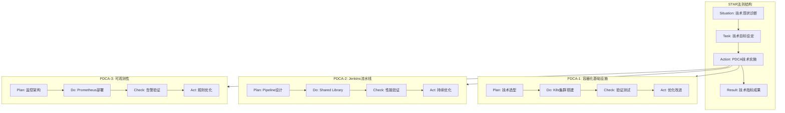
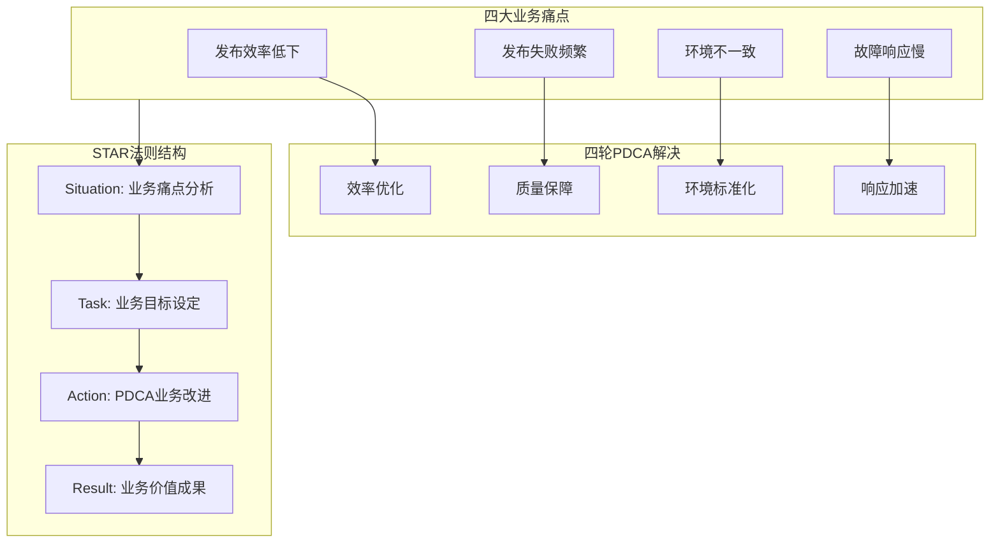
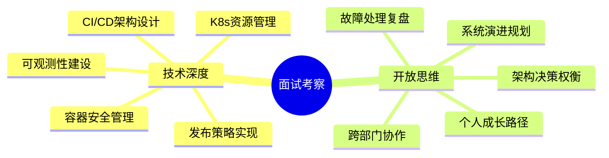
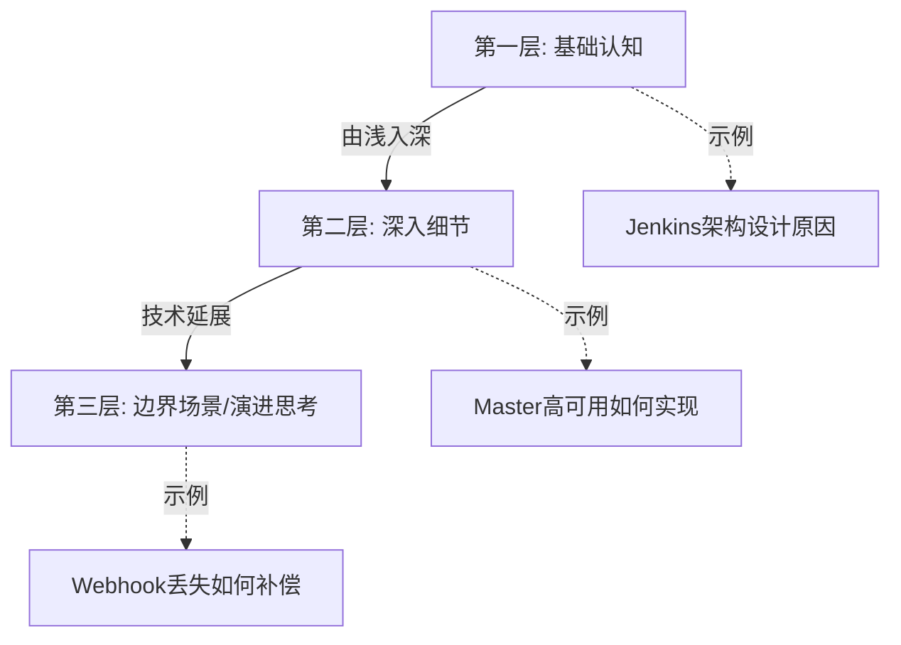
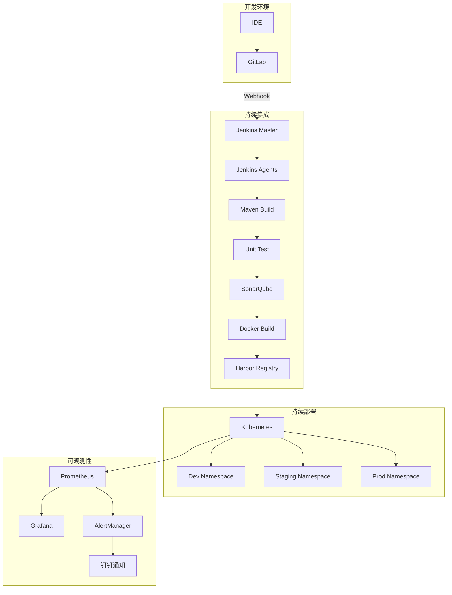

# 持续交付平台建设项目 - 交付总结

## 项目交付物清单

本项目共交付以下文档，存储于 `Example/` 目录：

| 序号 | 文件名 | 内容说明 | 适用场景 |
|------|--------|----------|----------|
| 1 | `持续交付简历_技术视角.md` | 技术演进维度的项目简历 | 简历撰写、技术汇报 |
| 2 | `持续交付简历_业务痛点视角.md` | 业务价值维度的项目简历 | 简历撰写、业务汇报 |
| 3 | `面试问答_持续交付平台_Part1.md` | 技术深度考察（5个维度） | 面试准备 |
| 4 | `面试问答_持续交付平台_Part2.md` | 开放思维与软技能（5个维度） | 面试准备 |
| 5 | `面试问答_持续交付平台_Part3.md` | 综合总结与快速参考 | 面试复习 |
| 6 | `项目交付总结.md` | 本文档 | 整体概览 |

---

## 简历项目核心结构

### 技术视角简历结构



### 业务视角简历结构



---

## 面试问答核心结构

### 10大考察维度



### 钻孔式提问结构



---

## 核心量化指标汇总

### 效能指标提升

| 指标类别 | 指标名称 | 改进前 | 改进后 | 提升幅度 |
|----------|----------|--------|--------|----------|
| 交付速度 | 部署频率 | 2-3次/月 | 15-20次/周 | 25倍 |
| 交付速度 | 单次部署耗时 | 4-6小时 | 8-12分钟 | 95%降低 |
| 交付速度 | 需求交付周期 | 4-6周 | 1-2周 | 3倍提升 |
| 交付质量 | 部署成功率 | 65% | 97.3% | 32.3%提升 |
| 交付质量 | 变更失败率 | 35% | 2.7% | 92%降低 |
| 故障响应 | MTTI | 30-60分钟 | 3分钟 | 95%降低 |
| 故障响应 | MTTR | 2-4小时 | 18分钟 | 90%降低 |
| 故障响应 | 回滚耗时 | 1-2小时 | 2分钟 | 98%降低 |

### 业务价值指标

| 指标类别 | 指标名称 | 改进前 | 改进后 | 业务影响 |
|----------|----------|--------|--------|----------|
| 故障成本 | 季度P1故障数 | 4次 | 0次 | 避免损失160万/半年 |
| 客户体验 | 稳定性评分 | 3.2/5 | 4.5/5 | 满意度大幅提升 |
| 团队效能 | 运维人工时间 | 40小时/月 | 5小时/月 | 释放运维产能 |
| 团队效能 | 环境准备时间 | 2-3周 | <1天 | 加速项目启动 |

---

## DevOps能力成熟度评估

### 项目演进路径

```
Level 1 (起点)          Level 3 (当前)           Level 5 (愿景)
    │                        │                        │
    │   手工操作              │   全流程自动化          │   持续优化
    │   部门孤岛              │   团队协作              │   数据驱动
    │   周/月级发布           │   日级发布              │   按需发布
    │                        │                        │
    └────────────────────────┴────────────────────────┘
              项目周期: 10个月                未来规划
```

### 各能力域成熟度

| 能力域 | 起点Level | 当前Level | 目标Level |
|--------|-----------|-----------|-----------|
| 部署流水线 | 1 | 3 | 4 |
| 部署与发布 | 1 | 3 | 4 |
| 环境管理 | 1 | 3 | 4 |
| 持续集成 | 1 | 3 | 4 |
| 可观测性 | 1 | 2-3 | 4 |
| 安全管理 | 1 | 2 | 3 |

---

## 技术架构概览

### 整体架构图



### 技术组件清单

| 层次 | 组件 | 版本/规格 | 用途 |
|------|------|-----------|------|
| 代码托管 | GitLab | CE 15.x | 源代码管理 |
| CI引擎 | Jenkins | 2.4x LTS | 流水线编排 |
| 构建工具 | Maven | 3.8.x | Java构建 |
| 代码质量 | SonarQube | 9.x | 静态分析 |
| 容器运行时 | Docker | 20.10.x | 容器化 |
| 镜像仓库 | Harbor | 2.x | 镜像管理 |
| 容器编排 | Kubernetes | 1.25.x | 容器调度 |
| 监控 | Prometheus | 2.4x | 指标采集 |
| 可视化 | Grafana | 9.x | 仪表盘 |
| 告警 | AlertManager | 0.25.x | 告警路由 |

---

## 文档使用指南

### 简历撰写场景

1. **技术岗位投递**: 优先使用 `持续交付简历_技术视角.md`
2. **管理岗位投递**: 优先使用 `持续交付简历_业务痛点视角.md`
3. **两者结合**: 根据JD要求，从两份简历中提取合适的内容

### 面试准备场景

1. **技术面试准备**: 重点复习 `面试问答_持续交付平台_Part1.md`
2. **行为面试准备**: 重点复习 `面试问答_持续交付平台_Part2.md`
3. **快速复习**: 使用 `面试问答_持续交付平台_Part3.md` 的速查表

### 知识巩固场景

1. **DevOps知识体系**: 参考Skills目录下的各能力域文档
2. **项目复盘总结**: 参考本文档的指标和架构总结
3. **技术分享准备**: 可从简历文档提取Mermaid图表

---

## 后续演进建议

### 内容扩展方向

1. **更多项目案例**: 基于相同框架撰写其他项目简历
2. **细分领域深化**: 针对K8s、监控、安全等领域深入展开
3. **行业案例对标**: 收集行业最佳实践进行对比分析

### 技术深度扩展

1. **GitOps实践**: 补充ArgoCD/Flux的实施经验
2. **混沌工程**: 补充故障注入和韧性测试实践
3. **AIOps探索**: 补充智能运维的探索经验

### 软技能扩展

1. **更多冲突案例**: 补充不同类型的冲突处理经验
2. **领导力案例**: 补充团队管理和人才培养经验
3. **战略思考**: 补充技术战略和组织变革经验

---

*文档版本: v1.0*  
*创建日期: 2024.01*  
*文档总计: 6个Markdown文件*


